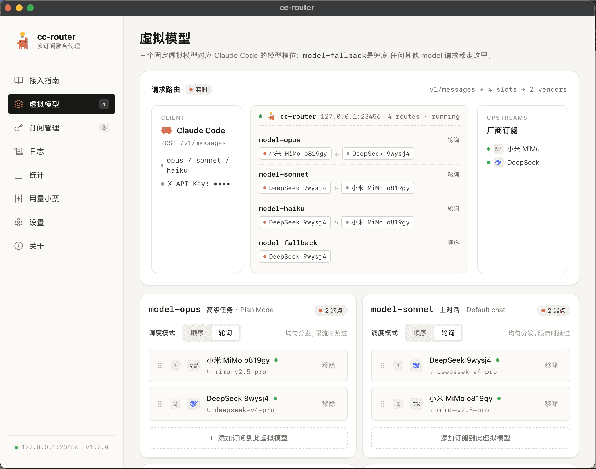
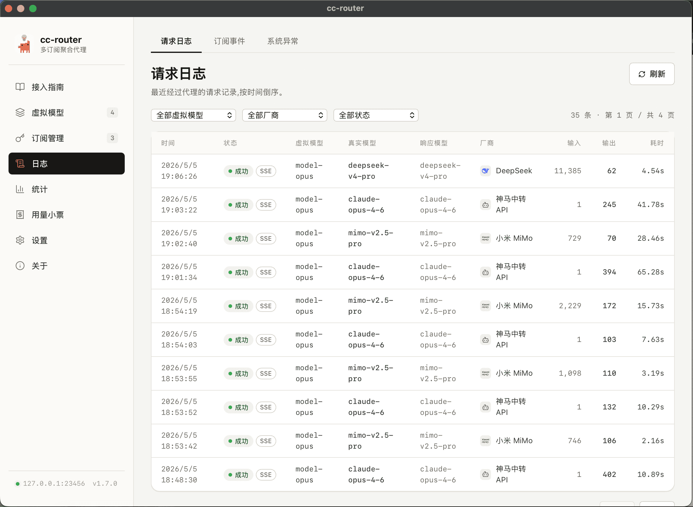

<p align="center">
  
</p>

<h1 align="center">cc-router</h1>

<p align="center">
  <a href="LICENSE"></a>
  
  
  
  
  
  
</p>

<p align="center">
  <a href="README.md">中文</a> · <strong>English</strong>
</p>

<p align="center">
  <a href="https://finch-xu.github.io/docs/cc-router/getting-started/">📖 Documentation</a>
</p>

Stacked subscriptions across multiple LLM vendors, but Claude Code can only point at one? cc-router merges the Token Plans, Coding Plans, and pay-as-you-go APIs of DeepSeek, Qwen, Kimi, MiMo, MiniMax, GLM, and Claude into a single virtual plan — mix and match across the opus / sonnet / haiku slots, dispatch sequentially or round-robin, and auto-switch on rate limits or failures, so every quota you paid for actually gets used.

> ⚠️ Notice: this tool only switches between subscription plans you already own. Request bodies are passed through almost verbatim — no reverse engineering, no jailbreak, no circumvention. You are responsible for complying with each plan's terms of service. cc-router is intended for use with coding tools like Claude Code only; do not use it for anything else.
>
> Provider terms of service do not necessarily allow "routing a subscription key through a third-party proxy with multi-virtual-model dispatch" — especially for per-seat subscriptions like Coding Plans / Token Plans, where this pattern may trip risk controls. The author assumes no liability for any account being throttled, banned, or having its subscription cancelled as a result of using this tool.
>
> This software is provided As-Is, without warranty of any kind. The author is not liable for any direct or indirect damages arising from its use, including but not limited to abnormal quota consumption, data loss, or business interruption.

<p align="center">
  
  <br />
  
</p>

## Supported Coding Plans and APIs

| id | Name | Token Plan | API | Status |
|---|---|---|---|---|
| `anthropic` | Anthropic official API (pay-as-you-go only, no Max Plan) | ❌ | ✅ | verified |
| `zhipu` | Zhipu GLM | ✅ | ✅ | verified |
| `deepseek` | DeepSeek | ❌ | ✅ | verified |
| `moonshot` | Moonshot Kimi | ✅ | ✅ | untested |
| `minimax` | MiniMax (3 endpoints) | ✅ | ✅ | partial |
| `xiaomi` | Xiaomi MiMo (pay-as-you-go + 3-cluster plans) | ✅ | ✅ | untested |
| `alibaba` | Alibaba Cloud Bailian (team Token Plan + 2-region pay-as-you-go + discontinued Coding Plan) | ✅ | ✅ | verified |
| `volcengine` | Volcengine Ark (Coding Plan subscription + pay-as-you-go) | ✅ | ✅ | untested |
| `openrouter` | OpenRouter aggregator (500+ models routed) | ❌ | ✅ | untested |
| `tencent` | Tencent Cloud LLM (Token Plan subscription + TokenHub pay-as-you-go, mainland / overseas) | ✅ | ✅ | untested |
| `aiberm` | Aiberm (pay-as-you-go API, models returned dynamically by token group) | ❌ | ✅ | untested |
| `whatai` | Shenma relay API (pay-as-you-go, OpenAI/Anthropic dual-protocol relay, Anthropic path only) | ❌ | ✅ | untested |
| `ollama` | Ollama local inference (localhost:11434 only, includes cloud tags like `glm-4.7:cloud`) | ❌ | ✅ | partial |
| `fireworks` | Fireworks AI (pay-as-you-go, covers DeepSeek / Qwen / Llama / Kimi and other open-source models), Fire Pass | ✅ | ✅ | verified |
| `stepfun` | Stepfun (Step Plan subscription + pay-as-you-go API) | ✅ | ✅ | untested |
| `baidu` | Baidu Qianfan (Coding Plan subscription, manual model entry) | ✅ | ❌ | untested |
| `modelscope` | ModelScope (pay-as-you-go, OpenAI/Anthropic dual-protocol, Anthropic path only, covers Qwen / DeepSeek / Kimi / MiniMax and other open-source models) | ❌ | ✅ | partial |
| `ucloud` | UCloud Modelverse (Coding Plan subscription + pay-as-you-go API in CN/global, aggregates Claude / Qwen / GLM / Kimi and more) | ✅ | ✅ | untested |
| `Custom` | Bring your own Anthropic-compatible endpoint | ✅ | ✅ | verified |

> The "Token Plan" column covers any subscription-style quota (Token Plan / Coding Plan, etc.); "API" denotes pay-as-you-go Anthropic Messages-compatible endpoints.

Community PRs welcome.

## Tech Stack

- Tauri 2
- Tailwind 4
- React 19

## Quick Start

1. Download the installer from Releases and run it.
2. Add your LLM subscriptions, bind them to virtual models, pick a dispatch mode.
3. Point Claude Code at cc-router via the env snippet below.

## Using with Claude Code

The **Settings** page renders the full env snippet dynamically — if the default port is taken, cc-router probes upward up to 100 times.

```json
{
  "env": {
    "ANTHROPIC_BASE_URL": "http://127.0.0.1:23456",
    "ANTHROPIC_AUTH_TOKEN": "your token, show in this app settings",
    "API_TIMEOUT_MS": "3000000",
    "ANTHROPIC_MODEL": "model-opus",
    "ANTHROPIC_DEFAULT_OPUS_MODEL": "model-opus",
    "ANTHROPIC_DEFAULT_SONNET_MODEL": "model-sonnet",
    "ANTHROPIC_DEFAULT_HAIKU_MODEL": "model-haiku",
    "CLAUDE_CODE_SUBAGENT_MODEL": "model-opus",
    "CLAUDE_CODE_DISABLE_NONESSENTIAL_TRAFFIC": "1",
    "CLAUDE_CODE_DISABLE_NONSTREAMING_FALLBACK": "1",
    "CLAUDE_CODE_EFFORT_LEVEL": "max"
  }
}
```

When the `OPUS_MODEL` supports a `1m` context window, set it to `model-opus[1m]` to get Claude Code's full long-context support.

## Development

Prerequisites: Node.js ≥ 20 (pnpm recommended), Rust ≥ 1.77, Xcode Command Line Tools (macOS).

```bash
pnpm install
pnpm tauri dev      # runs frontend + Rust backend + proxy in one process
```

First launch opens the onboarding flow:

1. Add a subscription (pick provider → endpoint → paste API key → auto-fetch the model list).
2. Bind the subscription to all three virtual models in one click.
3. Copy the generated env snippet into your `~/.claude/settings.json`.

## Adding a new provider

If you use **Claude Code**, this repo ships a `SKILL` named `new-provider`. Run it with the official docs URL or endpoint info of the target provider, and it will scaffold the YAML and wire up the related changes for you.

## Build

```bash
pnpm tauri build
```

Artifacts land in `src-tauri/target/release/bundle/` under per-platform subfolders.

## Icons

Provider brand logos come from [@lobehub/icons](https://github.com/lobehub/lobe-icons) (MIT). All trademarks belong to their respective owners.

## License

MIT
