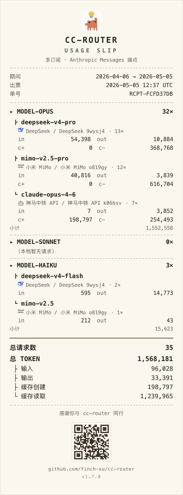

<p align="center">
  
</p>

<h1 align="center">cc-router</h1>

<p align="center">
  <a href="LICENSE"></a>
  
  
  
  
  
  
</p>

<p align="center">
  <strong>中文</strong> · <a href="README.en.md">English</a> · <a href="README.ja.md">日本語</a>
</p>

<p align="center">
  <a href="https://ccrouter.app/docs/" target="_blank" rel="noopener">📖 中文文档</a> ·
  <a href="https://ccrouter.app/en/docs/" target="_blank" rel="noopener">📖 English Docs</a> ·
  <a href="https://ccrouter.app/ja/docs/" target="_blank" rel="noopener">📖 日本語ドキュメント</a> ·
  <a href="https://deepwiki.com/finch-xu/cc-router" target="_blank" rel="noopener">🤖 DeepWiki</a> ·
  <a href="https://ccrouter.app" target="_blank" rel="noopener">🌐 官方网站ccrouter.app</a>
</p>

把零散的 `Token Plan`、`Coding Plan`、大模型 API 额度聚合成一个虚拟 Plan，一键接入 Claude Code、Claude Desktop App、OpenClaw、OpenCode、Codex 等工具 —— 省钱！省 Token！完全本地运行！

> 注意⚠️ 本工具仅限于自动切换订阅套餐，请求体几乎完全透传，不涉及逆向、不涉及破解等操作。用户需自行遵守每个编程套餐的使用规则。此工具只能用于 Claude Code 等编程工具，切勿用于其他用途。
>
> 各家 provider 的 ToS 不一定明确允许"订阅 Key 接第三方代理 + 多虚拟模型混调度"的用法，尤其是 Coding Plan / Token Plan 这类 per-seat 订阅，可能触发风控。因使用本工具导致账号被限速、被封禁、订阅被取消的，作者不承担任何责任。
>
> 本软件按 As-Is 提供，不对任何因使用造成的直接或间接损失负责，包括但不限于额度异常消耗、数据丢失、业务中断。

功能亮点：

- **19 家 provider 一站调度** —— 内置 DeepSeek、Qwen、Kimi、MiMo、MiniMax、GLM、Claude、Gemini 等 Token Plan / Coding Plan / API 额度,opus / sonnet / haiku 三槽位任意搭配,顺序或轮询自动切换
- **任意自定义端点** —— 内置厂商不够时,把任何 Anthropic Messages 兼容或 Gemini generateContent 兼容或 OpenAI Responses 兼容的 API 直接配进来,与内置订阅同等调度
- **用量小票** —— token 消费快照一键导出 PNG / PDF / HTML,黑白 / 彩色双模式,默认不显示价格只展示用量,扫底部二维码即跳仓库
- **三语完整翻译** —— 简体中文 / English / 日本語,可跟随系统或在设置页手动切换
- **虚拟模型多别名** —— opus / sonnet / haiku 三个槽位各识别多种命名,以 opus 为例,`model-opus` / `claude-opus-4-7` / `anthropic/model-opus` / `anthropic/claude-opus-4-7` 都路由到同一虚拟模型,工具用什么命名都不挑
- **本地 HTTPS** —— 一键生成自签 CA 与服务器证书,让只支持 HTTPS 的客户端也能接入 cc-router,详见[配置教程](https://ccrouter.app/docs/claude-desktop-integration/)
- **接入 Claude Desktop App** —— 借助本地 HTTPS 与虚拟模型别名,Anthropic 官方桌面端可直接走 cc-router 聚合的多家订阅,详见[配置教程](https://ccrouter.app/docs/claude-desktop-integration/)
- **双协议 API 入口** —— `Anthropic /v1/messages` 与 `OpenAI /v1/responses` 两套端点并行,Claude Code / Codex 等 Anthropic 与 OpenAI 生态的客户端都能一键接入

<table align="center">
  <tr>
    <td width="60%"></td>
    <td width="40%" rowspan="2"></td>
  </tr>
  <tr>
    <td width="60%"></td>
  </tr>
</table>

## 支持的编程套餐和API

| id | 名称 | Token Plan | API | 兼容性 |
|---|---|---|---|---|
| `anthropic` | Anthropic 官方 API（仅按量付费，不含 Plan） | ❌ | ✅ | verified |
| `openai_codex` | **OpenAI Codex (ChatGPT Plus/Pro 订阅)** 有封号风险，不推荐使用 | ✅ | ❌ | tested |
| `kiro` | **Kiro IDE (AWS)** 免费 Claude 订阅额度，灰色地带有封号风险，不推荐使用 | ✅ | ❌ | tested |
| `google_ai_studio` | **Google AI Studio (Gemini)** 按量付费 + 免费 quota | ❌ | ✅ | verified |
| `zhipu` | 智谱 GLM（按量付费/中国订阅） | ✅ | ✅ | verified |
| `deepseek` | DeepSeek（按量付费） | ❌ | ✅ | verified |
| `moonshot` | Moonshot Kimi（按量付费/中国订阅/国际订阅） | ✅ | ✅ | untested |
| `minimax` | MiniMax（按量付费/中国订阅/国际订阅） | ✅ | ✅ | verified |
| `xiaomi` | 小米 MiMo（按量付费/中国订阅/国际订阅） | ✅ | ✅ | verified |
| `alibaba` | 阿里云百炼（Token Plan 团队版 + 按量付费 2 地域 + 停售的 Coding Plan） | ✅ | ✅ | verified |
| `volcengine` | 字节跳动 火山方舟（Coding Plan 订阅 + Agent Plan 订阅 + 按量付费） | ✅ | ✅ | untested |
| `openrouter` | OpenRouter 聚合平台（500+ 模型路由） | ❌ | ✅ | untested |
| `tencent` | 腾讯云大模型（Token Plan 订阅 + TokenHub 按量付费境内/境外） | ✅ | ✅ | untested |
| `aiberm` | Aiberm（按量付费 API，模型按 token group 动态返回） | ❌ | ✅ | untested |
| `whatai` | 神马中转 API（按量付费，OpenAI/Anthropic 双协议中转，仅用 Anthropic 路径） | ❌ | ✅ | untested |
| `ollama` | Ollama 本地推理（仅 localhost:11434，含云端模型 tag 如 `glm-4.7:cloud`） | ❌ | ✅| partial |
| `fireworks` | Fireworks AI（按量付费/国际订阅Fire Pass） | ✅ | ✅ | verified |
| `stepfun` | 阶跃星辰（按量付费/中国订阅/国际订阅） | ✅ | ✅ | untested |
| `baidu` | 百度千帆（按量付费/中国订阅） | ✅ | ✅ | untested |
| `modelscope` | 魔搭 ModelScope（按量付费） | ❌ | ✅ | partial |
| `ucloud` | 优云智算 UCloud Modelverse（Coding Plan 订阅 + 按量付费 API 国内/海外） | ✅ | ✅ | untested |
| `openai` | **OpenAI 官方 API**（按量付费，含 GPT-5 / o3 / 4.1 等 reasoning 模型，自动翻译 Anthropic thinking ↔ OpenAI reasoning） | ❌ | ✅ | untested |
| `自定义` | 自定义任意Anthropic协议API | ✅ | ✅ | verified |
| `自定义 (Gemini 兼容)` | 接入任意 Gemini generateContent 兼容端点（中转站等），messages_path 用 `{model}` 占位符 | ❌ | ✅ | tested |
| `自定义 (OpenAI Responses 兼容)` | 接入任意 OpenAI `/v1/responses` 兼容端点（one-api / new-api 等中转站），自动协议翻译 | ❌ | ✅ | tested |
| `自定义 (OpenAI Chat Completions 兼容)` | 接入任意 OpenAI `/v1/chat/completions` 兼容端点（DeepSeek / Together / Groq / Ollama / one-api / new-api 等中转站），自动协议翻译，DeepSeek R1 等模型的 reasoning_content 暴露为 Claude Code thinking 块 | ❌ | ✅ | tested |

> Token Plan 列包含各厂商的套餐订阅形态（Token Plan / Coding Plan / Agent Plan 等）；API 列指按量付费的 Anthropic Messages 兼容端点。

社区可 PR 补充。

## 技术栈

- Tauri 2
- Tailwind 4
- React 19

## 安装使用

1. 在release里下载客户端并安装。
2. 配置多厂商的大模型，配置虚拟模型对应的真实模型和调度模式。
3. 配置到Claude Code中使用。

## 在 Claude Code 中使用

`设置` 页会动态显示完整的 env snippet；默认端口被占用时自动 +1 递增。

```json
{
  "env": {
    "ANTHROPIC_BASE_URL": "http://127.0.0.1:23456",
    "ANTHROPIC_AUTH_TOKEN": "your token, show in this app settings",
    "API_TIMEOUT_MS": "3000000",
    "ANTHROPIC_MODEL": "model-opus",
    "ANTHROPIC_DEFAULT_OPUS_MODEL": "model-opus",
    "ANTHROPIC_DEFAULT_SONNET_MODEL": "model-sonnet",
    "ANTHROPIC_DEFAULT_HAIKU_MODEL": "model-haiku",
    "CLAUDE_CODE_SUBAGENT_MODEL": "model-opus",
    "CLAUDE_CODE_DISABLE_NONESSENTIAL_TRAFFIC": "1",
    "CLAUDE_CODE_DISABLE_NONSTREAMING_FALLBACK": "1",
    "CLAUDE_CODE_ATTRIBUTION_HEADER": "0",
    "CLAUDE_CODE_EFFORT_LEVEL": "max"
  }
}
```

当`OPUS_MODEL`支持`1m`上下文的时候，可以设置为`model-opus[1m]`以获得Claude code工具的完整上下文支持。

也兼容 LiteLLM 风格的 `anthropic/` 前缀：`anthropic/model-opus` / `anthropic/model-sonnet` / `anthropic/model-haiku` 等同于无前缀写法，方便接入需要带 provider 前缀才能识别 Anthropic 协议的工具。

虚拟模型和别名：

| 虚拟模型 | 别名 |
|---|---|
|  `model-opus` |  `anthropic/model-opus` `anthropic/claude-opus-4-7`  `claude-opus-4-7` `gpt-5.5` `openai/gpt-5.5` |
|  `model-sonnet` |  `anthropic/model-sonnet` `anthropic/claude-sonnet-4-6`  `claude-sonnet-4-6` `gpt-5.4` `openai/gpt-5.4` |
|  `model-haiku` |  `anthropic/model-haiku` `anthropic/claude-haiku-4-5`  `claude-haiku-4-5`  `gpt-5.4-mini` `openai/gpt-5.4-mini` |

## 常见问题&使用场景

<details>
<summary>cc-router 解决了什么问题？</summary>

**没有 cc-router 时**：AI Agent（Claude Code / OpenCode 等）一次只能接一家厂商，小额度订阅在关键时刻断流，得手动切配置——体验糟糕。

**接上 cc-router 后**：Agent → cc-router → 厂商 A + B + C，自动负载均衡、自动故障转移，三家订阅当一家用。

收益：

- **省钱** —— 不必买昂贵的大额 Coding Plan，两个小额度拼起来就够用
- **不断流** —— 限流 / 失败自动切换，Agent 无感
- **混搭顶配** —— GLM-5.1、DeepSeek-V4-Pro、MiniMax-2.7、MiMo-V2.5-Pro 同时上桌，也能掺 Claude Opus、GPT-5.5 这类原生 API
- **用量统一** —— 所有订阅 token 消费一屏看完，可一键导出小票

</details>

<details>
<summary><code>model-opus</code> / <code>model-sonnet</code> / <code>model-haiku</code> 三个虚拟模型是干啥的？</summary>

Claude Code 按任务难度分三档：opus 做规划、sonnet 写代码、haiku 跑工具调用。

cc-router 把这三档抽象成 `model-opus` / `model-sonnet` / `model-haiku` 三个虚拟槽位，每个槽位绑一组真实模型 + 调度模式：

- `model-opus` → DeepSeek-V4-Pro + GLM-5.1（轮询）
- `model-sonnet` → MiniMax-M2.7 + MiMo-V2.5-Pro（轮询）
- `model-haiku` → GLM-4-Flash

CC 请求来了就按映射转发，不用再频繁改 `~/.claude/settings.json`。

</details>

<details>
<summary>有多个 Coding Plan 怎么搭配？</summary>

举例：订阅 A = GLM-5 / MiniMax-2.7 / DeepSeek-Flash，订阅 B = DeepSeek-V4-Pro / MiniMax-2.7 / GLM-5。

- **稳妥派**：把两边的同档模型一起绑进对应槽位，效果一致、容灾好
- **激进派**：把两边各自的顶配模型都塞进 `model-opus` 轮询，交叉使用大概率 `1 + 1 ≥ 2`

</details>

<details>
<summary>调度模式：顺序还是轮询？</summary>

- **顺序** —— 用完 A 再切 B。命中缓存好、能榨干小额度订阅，**推荐给两个小额 GLM Coding Plan 这类场景**
- **轮询** —— 两家均衡分担。但跨账号的缓存是独立的，会多吃额度，换来的是真正的负载均衡

</details>

## 开发

依赖：Node.js ≥ 20（推荐 pnpm），Rust ≥ 1.77，Xcode CLT（macOS）。

```bash
pnpm install
pnpm tauri dev      # 启动开发模式（同时运行前端 + Rust 后端 + 代理）
```

首次启动 app 会进入 onboarding：

1. 添加一个订阅（选厂商 → 选接入点 → 填 API Key → 自动抓取模型列表）
2. 一键把订阅绑定到三个虚拟模型
3. 复制 Claude Code 环境变量配置，粘到你的 `~/.claude/settings.json`

## 添加新provider

如果你使用`Claude Code`，我提供了一个`SKILL`，可以执行`new-provider`并附加provider的官方文档或接口地址等信息，能够自动创建provider的配置。

## 打包

```bash
pnpm tauri build
```

产出：`src-tauri/target/release/bundle/` 下对应平台的安装包。

## 图标

Provider 品牌 logo 来自 [@lobehub/icons](https://github.com/lobehub/lobe-icons)（MIT）。各品牌商标归原所有者所有。

## 证书

MIT
