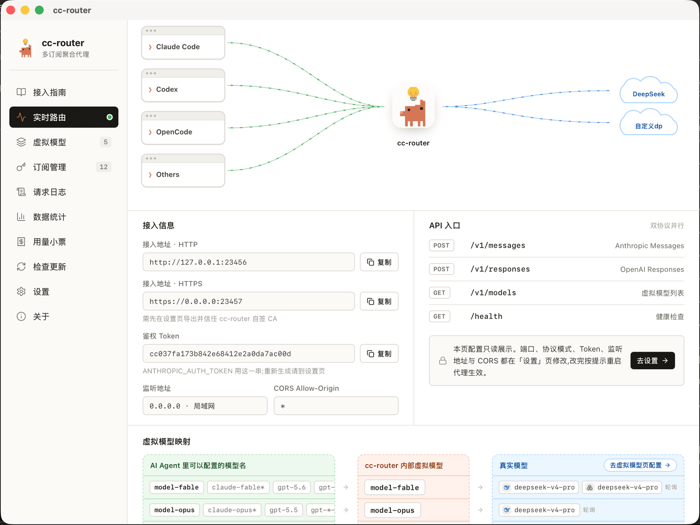
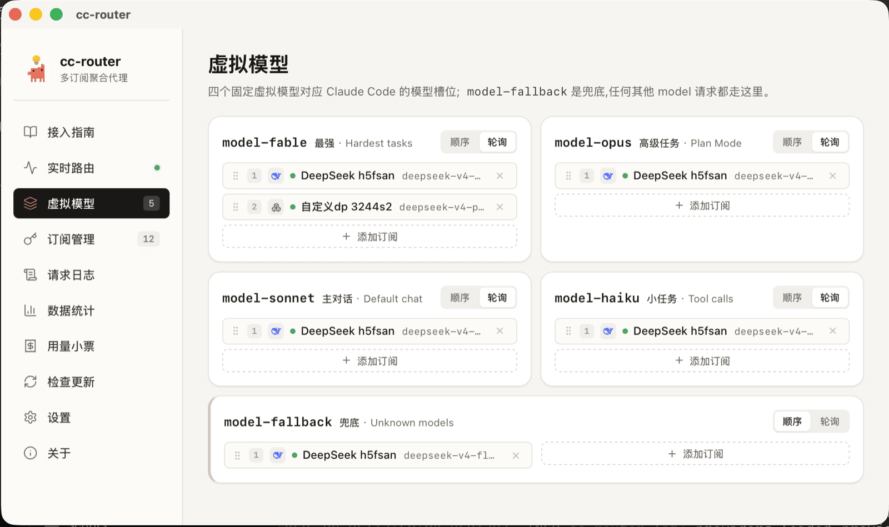
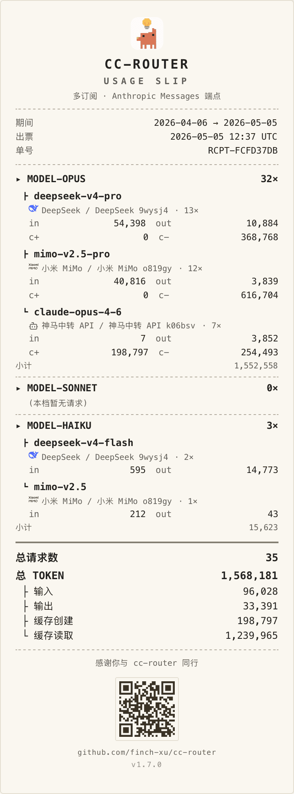
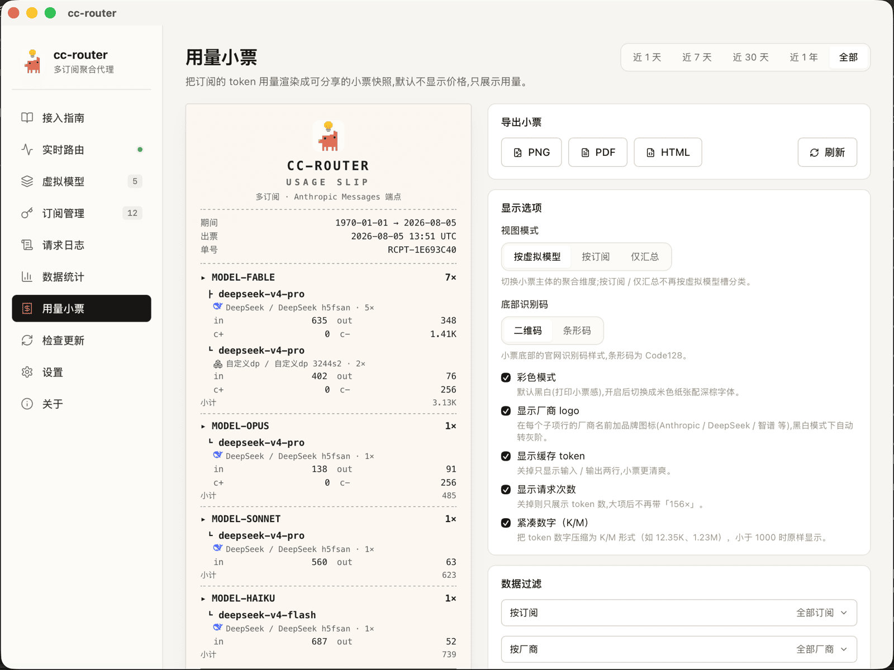
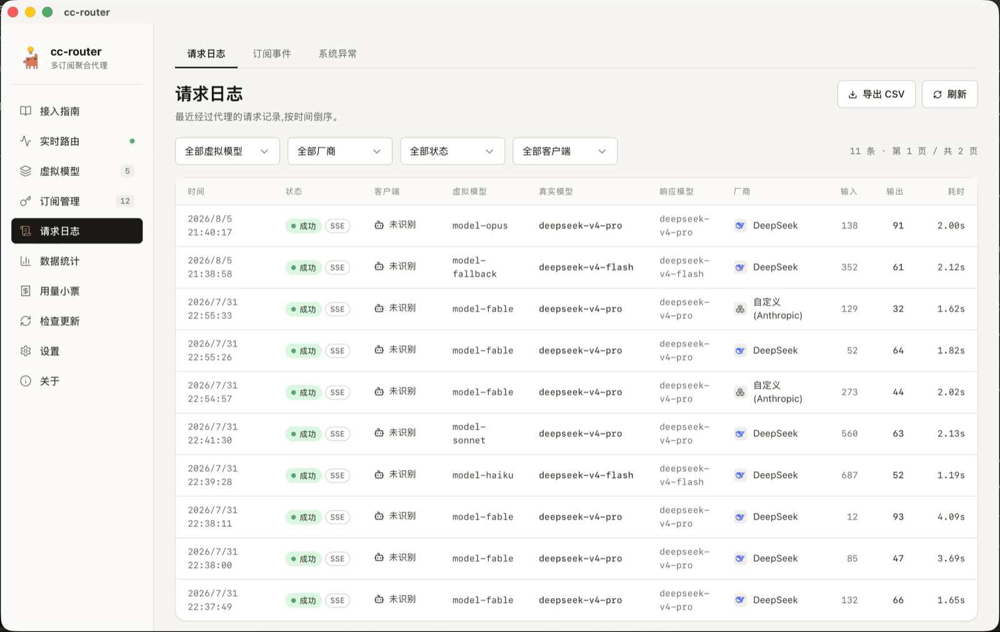

<p align="center">
  
</p>

<h1 align="center">cc-router</h1>

<p align="center">
  <a href="LICENSE"></a>
  
  
  
  
  
  
</p>

<p align="center">
  <strong>中文</strong> · <a href="README.en.md">English</a> · <a href="README.ja.md">日本語</a>
</p>

<p align="center">
  <a href="https://ccrouter.app/docs/" target="_blank" rel="noopener">📖 中文文档</a> ·
  <a href="https://ccrouter.app/en/docs/" target="_blank" rel="noopener">📖 English Docs</a> ·
  <a href="https://ccrouter.app/ja/docs/" target="_blank" rel="noopener">📖 日本語ドキュメント</a> ·
  <a href="https://deepwiki.com/finch-xu/cc-router" target="_blank" rel="noopener">🤖 DeepWiki</a> ·
  <a href="https://ccrouter.app" target="_blank" rel="noopener">🌐 官方网站ccrouter.app</a>
</p>

本地运行的大模型聚合网关，GUI桌面端app，零代码部署，把零散的 `Token Plan`、`Coding Plan`、大模型 API 额度聚合成一个虚拟 Plan，一键接入 Claude Code、Claude Desktop App、OpenClaw、OpenCode、Codex 等工具 —— 省钱！省 Token！完全本地运行！

> 注意⚠️ 本工具仅限于自动切换订阅套餐，请求体几乎完全透传，不涉及逆向、不涉及破解等操作。用户需自行遵守每个编程套餐的使用规则。此工具只能用于 Claude Code 等编程工具，切勿用于其他用途。
>
> 各家 provider 的 ToS 不一定明确允许"订阅 Key 接第三方代理 + 多虚拟模型混调度"的用法，尤其是 Coding Plan / Token Plan 这类 per-seat 订阅，可能触发风控。因使用本工具导致账号被限速、被封禁、订阅被取消的，作者不承担任何责任。
>
> 本软件按 As-Is 提供，不对任何因使用造成的直接或间接损失负责，包括但不限于额度异常消耗、数据丢失、业务中断。

架构与请求走向一览：

```text
 Claude Code    OpenCode    OpenClaw   pi ...   Codex ...      Open WebUI / Cherry Studio ...
      |             |           |         |         |                         |
      -------------------------------------         |                         |
                        |                           |                         |
                    Anthropic                    OpenAI                    OpenAI
                  Messages API                Responses API         Chat Completions API
                 (/v1/messages)              (/v1/responses)       (/v1/chat/completions)
                        |                           |                         |
                        -------------------------------------------------------
                                                  |  入口 · 虚拟模型
                                                  |
                                              cc-router
                                        (本地 127.0.0.1:23456)
                                                  |
                                                  |  出口 · 真实模型
           -----------------------------------------------------------------------------
           |            |            |            |            |            |          |
       DeepSeek        GLM         Kimi       Anthropic     OpenAI       Gemini     ......
          API        Coding       Coding      Messages    Responses &      API
                      Plan         Plan          API      Completions
```

功能亮点：

- **入口三协议，工具随便接** —— 同时开放 Anthropic Messages / OpenAI Responses / OpenAI Chat Completions 三个端点，Claude Code、Codex、OpenClaw、Hermes Agent、Kimi Code、ZCode、Cherry Studio 等无需改造直接接入
- **出口三协议，订阅一站调度** —— 内置 24 家厂商预设（DeepSeek、Qwen、Kimi、MiMo、MiniMax、GLM、Claude、OpenAI、Gemini 等），任何 Anthropic / OpenAI / Gemini 兼容端点也能直接配进来
- **聚合所有模型Token** —— 顺序 / 轮询 / 会话亲和、自动切换、故障转移
- **用量小票** —— token 用量一键导出成一张「超市小票」样式的消费凭证，晒图、留档都方便
- **三语完整翻译** —— 简体中文 / English / 日本語，可跟随系统或在设置页手动切换
- **虚拟模型多别名** —— fable / opus / sonnet / haiku 四个槽位各识别多种命名，以 opus 为例，`model-opus` / `claude-opus-4-7` / `anthropic/model-opus` / `anthropic/claude-opus-4-7` 都路由到同一虚拟模型，工具用什么命名都不挑
- **本地 HTTPS** —— 一键生成自签 CA 与服务器证书，让只支持 HTTPS 的客户端也能接入 cc-router，详见[配置教程](https://ccrouter.app/docs/claude-desktop-integration/)
- **接入 Claude Desktop App** —— 借助本地 HTTPS 与虚拟模型别名，Anthropic 官方桌面端可直接走 cc-router 聚合的多家订阅，详见[配置教程](https://ccrouter.app/docs/claude-desktop-integration/)

<table align="center">
  <tr>
    <td width="40%"></td>
    <td width="40%"></td>
    <td width="20%" rowspan="2"></td>
  </tr>
  <tr>
    <td width="40%"></td>
    <td width="40%"></td>
  </tr>
</table>

## 接入指南

下方这些 AI Agent / Coding Agent 工具都能接入 cc-router，用上你手里的全部大模型 Plan：

<p>
<a href="https://ccrouter.app/docs/getting-started/" target="_blank" rel="noopener">Claude Code cli</a> · 
<a href="https://ccrouter.app/docs/claude-desktop-integration/" target="_blank" rel="noopener">Claude Desktop App</a> · 
<a href="https://ccrouter.app/docs/codex-integration/" target="_blank" rel="noopener">OpenAI Codex cli</a> · 
<a href="https://ccrouter.app/docs/codex-integration/" target="_blank" rel="noopener">OpenAI Codex Desktop App</a> · OpenCode · OpenClaw · Kimi code cli · pi coding agent 等，还有很多。
</p>

## 安装使用

1. 在 Release 页下载对应平台的安装包并安装。
2. 添加各家厂商的订阅，给虚拟模型绑定真实模型并选好调度模式。
3. 把生成的配置粘到 Claude Code 等工具里即可使用。

## 在 Claude Code 中使用

```json
{
  "env": {
    "ANTHROPIC_BASE_URL": "http://127.0.0.1:23456",
    "ANTHROPIC_AUTH_TOKEN": "your token, show in this app settings",
    "API_TIMEOUT_MS": "3000000",
    "ANTHROPIC_MODEL": "model-fable",
    "ANTHROPIC_DEFAULT_FABLE_MODEL": "model-fable",
    "ANTHROPIC_DEFAULT_OPUS_MODEL": "model-opus",
    "ANTHROPIC_DEFAULT_SONNET_MODEL": "model-sonnet",
    "ANTHROPIC_DEFAULT_HAIKU_MODEL": "model-haiku",
    "CLAUDE_CODE_SUBAGENT_MODEL": "model-opus",
    "CLAUDE_CODE_DISABLE_NONESSENTIAL_TRAFFIC": "1",
    "CLAUDE_CODE_DISABLE_NONSTREAMING_FALLBACK": "1",
    "CLAUDE_CODE_ATTRIBUTION_HEADER": "0",
    "CLAUDE_CODE_EFFORT_LEVEL": "max"
  }
}
```

当`OPUS_MODEL`支持`1m`上下文的时候，可以设置为`model-opus[1m]`以获得Claude code工具的完整上下文支持。

也兼容 LiteLLM 风格的 `anthropic/` 前缀：`anthropic/model-opus` / `anthropic/model-sonnet` / `anthropic/model-haiku` 等同于无前缀写法，方便接入需要带 provider 前缀才能识别 Anthropic 协议的工具。

虚拟模型和别名：

| 虚拟模型 | 别名 |
|---|---|
|  `model-fable` |  `anthropic/model-fable` `anthropic/claude-fable*` `claude-fable*` `gpt-5.6` `gpt-*-sol` `openai/gpt-5.6` `openai/gpt-*-sol` |
|  `model-opus` |  `anthropic/model-opus` `anthropic/claude-opus*` `claude-opus*` `gpt-5.5` `gpt-*-terra` `openai/gpt-5.5` `openai/gpt-*-terra` |
|  `model-sonnet` |  `anthropic/model-sonnet` `anthropic/claude-sonnet*` `claude-sonnet*` `gpt-5.4` `gpt-*-luna` `openai/gpt-5.4` `openai/gpt-*-luna` |
|  `model-haiku` |  `anthropic/model-haiku` `anthropic/claude-haiku*` `claude-haiku*`  `gpt-*-mini` `openai/gpt-*-mini` |

> `claude-opus*` 的含义是模糊匹配，你可以传入任意符合规则的模型名，都会被归一为虚拟模型`model-opus`，比如 `claude-opus-4-8` `claude-opus-4-7-20260101` `claude-opus-100` 都没问题。`gpt-*-sol` 这类按档位段匹配：`gpt-5.6-sol` `gpt-6-sol` `gpt-5.6-sol-20261201` 都命中 sol 档（terra/luna/mini 同理）。

## 入口与出口

cc-router 夹在你的工具和大模型厂商中间：工具从**入口**连进来，请求从**出口**发给厂商。两头各支持三种主流大模型接口，可以任意组合——比如 Codex 从 OpenAI Responses 入口进来，最终由 DeepSeek 的 Anthropic 端点作答。

### 入口：你的工具怎么连 cc-router

三个入口共用同一套订阅、虚拟模型、限额与会话亲和，请求日志的「入口接口」一栏能看到每条请求从哪个入口进来。按你的工具支持的协议展开对应一节：

<details>
<summary><b>Anthropic Messages</b> <code>/v1/messages</code> —— Claude Code、Claude Desktop、OpenCode、OpenClaw、pi、Kimi code cli 等</summary>

| 配置项 | 填写 |
|---|---|
| Base URL | `http://127.0.0.1:23456`（不带 `/v1`，工具会自己拼 `/v1/messages`） |
| 鉴权 | `x-api-key: <token>` 或 `Authorization: Bearer <token>`，对应 Claude Code 的 `ANTHROPIC_API_KEY` / `ANTHROPIC_AUTH_TOKEN` |
| 模型名 | `model-fable` / `model-opus` / `model-sonnet` / `model-haiku`，或上方别名表里的任意写法（含 `anthropic/` 前缀） |

- 这是主入口，请求原样透传不做协议翻译，thinking、`output_config.effort`、`cache_control`、图片、工具调用全部按 Anthropic 原生语义工作。
- Claude Code 的完整 env 示例见上方「在 Claude Code 中使用」；Claude Desktop 需要本地 HTTPS，见[配置教程](https://ccrouter.app/docs/claude-desktop-integration/)。
- 会话亲和优先按 `x-claude-code-session-id` 请求头、其次 `metadata.user_id` 识别会话。
- 设置页开启「透传客户端请求头」后，`anthropic-beta` / `anthropic-version` 等白名单头会原样转发给上游，默认关闭。

</details>

<details>
<summary><b>OpenAI Responses</b> <code>/v1/responses</code> —— Codex CLI、Codex Desktop App 及其他 Responses 客户端</summary>

| 配置项 | 填写 |
|---|---|
| Base URL | `http://127.0.0.1:23456/v1` |
| API Key | cc-router 设置页里的 token，Codex 从 `OPENAI_API_KEY` 或 `~/.codex/auth.json` 读取 |
| 模型名 | `gpt-5.6` / `gpt-5.5` / `gpt-5.4` / `gpt-5.4-mini`，或 `openai/` 前缀、`gpt-*-sol/terra/luna/mini` 档位名，分别落到 fable / opus / sonnet / haiku；也接受 `model-*` 写法 |

`~/.codex/config.toml` 片段（设置页「集成」可一键写入并自动备份原文件，之后用 `codex -p cc-router` 启动）：

```toml
[model_providers.cc-router]
name = "cc-router"
base_url = "http://127.0.0.1:23456/v1"
wire_api = "responses"
env_key = "OPENAI_API_KEY"

[profiles.cc-router]
model_provider = "cc-router"
model = "model-sonnet"
```

- 请求在内部翻译为 Anthropic Messages：`instructions` 与 developer 消息并入 system，`reasoning.effort` 映射为 thinking 预算，`max_output_tokens` 映射为 `max_tokens`（缺省 4096，并会自动抬高到覆盖 thinking 预算）。
- reasoning 双向：上游的 thinking 以带签名的 reasoning item 返回，客户端下一轮原样回传即可保持多轮推理上下文。
- 不支持图片输入，也不支持 `file_search` / `web_search` / `computer_use` 这类 OpenAI 专有工具；`parallel_tool_calls` 会被忽略。
- 会话亲和按 `prompt_cache_key`、其次 `session_id` 请求头识别，Codex 都会自带。
- 详细步骤见[配置教程](https://ccrouter.app/docs/codex-integration/)。

</details>

<details>
<summary><b>OpenAI Chat Completions</b> <code>/v1/chat/completions</code> —— Open WebUI、Cherry Studio、Cline、LobeChat 等</summary>

Open WebUI、Cherry Studio、Cline、LobeChat 等只支持 OpenAI Chat Completions 的工具，把「OpenAI 兼容」端点指向 cc-router 即可：

| 配置项 | 填写 |
|---|---|
| Base URL | `http://127.0.0.1:23456/v1`（有的工具要求不带 `/v1`，按工具提示调整） |
| API Key | cc-router 设置页里的 token（关闭鉴权时随便填一个非空值） |
| 模型名 | `model-fable` / `model-opus` / `model-sonnet` / `model-haiku`，或 `gpt-5.6` / `gpt-5.5` / `gpt-5.4` / `gpt-5.4-mini` 等别名，从 `GET /v1/models` 可直接拉取 |

行为说明：

- 请求在 cc-router 内部翻译成 Anthropic Messages 走同一套调度，订阅、虚拟模型、限额、会话亲和全部生效；请求日志里「入口接口」显示 `/v1/chat/completions`。
- 上游的 thinking 以 `reasoning_content` 字段返回（DeepSeek 惯例，主流客户端都能折叠显示）；对话历史里客户端回传的 `reasoning_content` 会被丢弃，不影响后续对话。
- 图片支持 `data:` base64 与 `http(s)` 两种 `image_url`；工具调用双向支持；流式响应末尾总会带一帧 `usage`。
- 不支持旧版 `functions` / `function_call` 字段，传了直接返回 400，请改用 `tools` / `tool_choice`。
- `n>1`、`logprobs`、`response_format` 的 JSON Schema 强制均会被忽略（不报错）。
- 会话亲和（sticky）优先按 `user` 字段、其次 `x-session-id` 请求头识别会话，两者都没有时按首条用户消息内容。
- 响应里出现工具调用时 `finish_reason` 恒为 `tool_calls`，客户端可放心据此判断是否执行工具。

</details>

### 出口：cc-router 怎么连厂商

出口按协议分三类，另有一类走 OAuth 登录的订阅账号。内置厂商预设和自定义端点走的是同一条路，区别只是内置预设已经替你填好地址、鉴权方式和模型列表。完整内置清单以 app 内「添加订阅」页为准，描述文件在 [`src-tauri/providers/`](src-tauri/providers/)，欢迎 PR 补充。

<details>
<summary><b>Anthropic Messages 兼容</b> —— 主路径，请求原样透传</summary>

- 内置：Anthropic 官方、DeepSeek、智谱 GLM、Moonshot Kimi、MiniMax、小米 MiMo、阿里云百炼、火山方舟、腾讯云、百度千帆、阶跃星辰、魔搭 ModelScope、优云智算、Fireworks、OpenRouter、xAI Grok、Aiberm、神马中转、Ollama 等，覆盖各家的 Token Plan / Coding Plan / Agent Plan 订阅与按量付费 API
- 自定义：任何 Anthropic Messages 兼容端点（中转站、自建网关等），填 Base URL + Key 即可
- 不做协议翻译，thinking、`output_config.effort`、`cache_control`、图片、工具调用全部按 Anthropic 原生语义工作。**只要厂商提供原生 Anthropic 端点，就优先走这条路**，翻译路径多少会丢内容

</details>

<details>
<summary><b>OpenAI 兼容</b> <code>/v1/responses</code> · <code>/v1/chat/completions</code> —— 协议翻译</summary>

- 内置：OpenAI 官方 API（GPT-5 / o3 / 4.1 等 reasoning 模型）
- 自定义：任意 OpenAI Responses 或 Chat Completions 兼容端点，如 one-api / new-api 中转站、Groq、Together、本地 vLLM / llama.cpp
- cc-router 把 Anthropic Messages 翻译成对应协议再发出：Anthropic thinking ↔ OpenAI reasoning 双向映射，多轮推理上下文自动回灌；Chat Completions 返回的 `reasoning_content`（DeepSeek R1 等）会以 thinking 块的形式交给 Claude Code
- 翻译层表达不了的内容（如 `cache_control`）会被丢弃，所以有原生 Anthropic 端点的厂商请配到上一类，不要配到这里

</details>

<details>
<summary><b>Gemini 兼容</b> <code>generateContent</code> · <code>/v1beta/interactions</code> —— 协议翻译</summary>

- 内置：Google AI Studio（generateContent，按量付费 + 免费 quota）、Google Gemini Interactions API（新统一接口）
- 自定义：任意 Gemini generateContent 兼容端点（messages_path 用 `{model}` 占位符），或 Interactions 兼容端点（model 在请求 body 里，无需占位符）
- thinking 双向映射，工具调用往返时自动携带 thought signature

</details>

<details>
<summary><b>订阅账号出口（OAuth）</b> —— Codex（ChatGPT Plus/Pro）、Kiro（AWS）</summary>

- 不用 API Key，通过 OAuth 设备码登录，把 ChatGPT 订阅 / Kiro 免费 Claude 额度当作出口
- **属于灰色地带，有封号风险，不推荐当主力**，建议只做兜底或副号；由此导致的限速、封禁或订阅取消，作者概不负责

</details>

## 常见问题&使用场景

<details>
<summary>cc-router 解决了什么问题？</summary>

**没有 cc-router 时**：AI Agent（Claude Code / OpenCode 等）一次只能接一家厂商，小额度订阅在关键时刻断流，得手动切配置——体验糟糕。

**接上 cc-router 后**：Agent → cc-router → 厂商 A + B + C，自动负载均衡、自动故障转移，三家订阅当一家用。

收益：

- **省钱** —— 不必买昂贵的大额 Coding Plan，两个小额度拼起来就够用
- **不断流** —— 限流 / 失败自动切换，Agent 无感
- **混搭顶配** —— GLM-5.1、DeepSeek-V4-Pro、MiniMax-2.7、MiMo-V2.5-Pro 同时上桌，也能掺 Claude Opus、GPT-5.5 这类原生 API
- **用量统一** —— 所有订阅 token 消费一屏看完，可一键导出小票

</details>

<details>
<summary><code>model-opus</code> / <code>model-sonnet</code> / <code>model-haiku</code> 三个虚拟模型是干啥的？</summary>

Claude Code 按任务难度分三档：opus 做规划、sonnet 写代码、haiku 跑工具调用。

cc-router 把这三档抽象成 `model-opus` / `model-sonnet` / `model-haiku` 三个虚拟槽位，每个槽位绑一组真实模型 + 调度模式：

- `model-opus` → DeepSeek-V4-Pro + GLM-5.1（轮询）
- `model-sonnet` → MiniMax-M2.7 + MiMo-V2.5-Pro（轮询）
- `model-haiku` → GLM-4-Flash

CC 请求来了就按映射转发，不用再频繁改 `~/.claude/settings.json`。

</details>

<details>
<summary>有多个 Coding Plan 怎么搭配？</summary>

举例：订阅 A = GLM-5 / MiniMax-2.7 / DeepSeek-Flash，订阅 B = DeepSeek-V4-Pro / MiniMax-2.7 / GLM-5。

- **稳妥派**：把两边的同档模型一起绑进对应槽位，效果一致、容灾好
- **激进派**：把两边各自的顶配模型都塞进 `model-opus` 轮询，交叉使用大概率 `1 + 1 ≥ 2`

</details>

<details>
<summary>调度模式：顺序、轮询还是会话亲和？</summary>

- **顺序** —— 用完 A 再切 B。命中缓存好、能榨干小额度订阅，**推荐给两个小额 GLM Coding Plan 这类场景**
- **轮询** —— 两家均衡分担。但跨账号的缓存是独立的，会多吃额度，换来的是真正的负载均衡
- **会话亲和** —— 同一个 Claude Code 会话固定用同一家订阅、不同会话轮流分配。既像轮询一样均衡，又不丢 prompt cache；并发子代理也能共用缓存。订阅限流/失败时自动换家。**多家订阅都健康、又在意缓存命中时推荐。**

</details>

## 开发

- Tauri 2
- Tailwind 4
- React 19

依赖：Node.js ≥ 20（推荐 pnpm），Rust ≥ 1.88（建议直接用 rustup 最新 stable），Xcode CLT（macOS）。

```bash
pnpm install
pnpm tauri dev      # 启动开发模式（同时运行前端 + Rust 后端 + 代理）
```

首次启动 app 会进入 onboarding：

1. 添加一个订阅（选厂商 → 选接入点 → 填 API Key → 自动抓取模型列表）
2. 一键把订阅绑定到四个虚拟模型
3. 复制 Claude Code 环境变量配置，粘到你的 `~/.claude/settings.json`

## 打包

```bash
pnpm tauri build
```

产出：`src-tauri/target/release/bundle/` 下对应平台的安装包。

## Windows 开发环境注意事项

<details>
<summary>在 Windows 上开发或打包遇到问题时展开（能省几小时）</summary>

**1. 必须用 MSVC toolchain，不能用 GNU**

Tauri 在 Windows 上打包依赖 MSVC，CI 用的也是 `x86_64-pc-windows-msvc`。确认：

```powershell
rustup show          # active toolchain 应带 -msvc 后缀
rustc --version      # 应 ≥ 1.88
```

**2. 需要 Visual Studio Build Tools**

MSVC toolchain 依赖 C++ 编译器和 Windows SDK，缺了会报 `link.exe not found`。装 [Build Tools for Visual Studio](https://visualstudio.microsoft.com/downloads/) 时勾选「使用 C++ 的桌面开发」工作负载，装完重开终端。

**3. `rustc --version` 和 `rustup show` 对不上？查 PATH**

若曾用 msi / scoop / Visual Studio 组件装过独立 Rust，它可能排在 rustup shim 之前，导致 `rustup default stable` 说什么都不生效：

```powershell
Get-Command rustc, cargo -All | Select-Object Source
```

`Source` 应指向 `%USERPROFILE%\.cargo\bin`。否则把该目录提到 PATH 最前（`rundll32 sysdm.cpl,EditEnvironmentVariables`），或卸掉那份独立安装。

**4. dev server 端口残留**

Ctrl+C 常杀不干净 `tauri dev` 的进程树，再次启动会报 `Port 1420 is already in use`（`strictPort: true` 刻意不自动换端口，因为 `devUrl` 写死了 1420）：

```powershell
Get-NetTCPConnection -LocalPort 1420 -State Listen |
  Select-Object -ExpandProperty OwningProcess -Unique |
  ForEach-Object { Stop-Process -Id $_ -Force }
```

</details>

## 添加新provider

如果你使用`Claude Code`，我提供了一个`SKILL`，可以执行`new-provider`并附加provider的官方文档或接口地址等信息，能够自动创建provider的配置。

## 证书

本项目以 [MIT](LICENSE) 许可证发布。

字体：小票主题使用的 9 款字体均为 SIL Open Font License 1.1，归属声明与许可证全文见 [THIRD-PARTY-NOTICES.md](THIRD-PARTY-NOTICES.md)。

图标：Provider 品牌 logo 来自 [@lobehub/icons](https://github.com/lobehub/lobe-icons)（MIT）。各品牌商标归原所有者所有。
